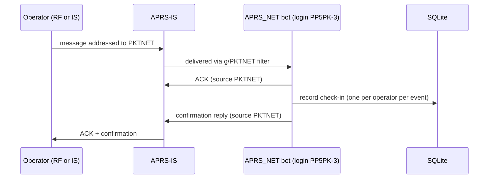

# APRS_NET


An **APRS net check-in bot** in the style of **#APRSThursday**, plus a matching
**PDF certificate generator**.

Operators send an APRS message to a special net callsign (e.g. `PKTNET`). The
bot acknowledges each message, logs the check-in to a local SQLite database, and
replies with a short confirmation. After the net, a companion tool turns the
logged check-ins into one participation certificate per operator, showing the
event name, date and check-in time.

It is designed to run on a Raspberry Pi, alongside an existing Direwolf
digipeater/igate, and uses only the Python standard library for the bot itself
(the certificate generator adds `reportlab`).

---

## Table of contents

- [Features](#features)
- [How it works](#how-it-works)
- [Components](#components)
- [Requirements](#requirements)
- [Installation](#installation)
- [Configuration](#configuration)
- [Usage](#usage)
  - [The daemon](#the-daemon)
  - [Managing events](#managing-events)
  - [Certificates](#certificates)
- [Database schema](#database-schema)
- [Operational notes](#operational-notes)
- [Roadmap](#roadmap)
- [Credits](#credits)
- [License](#license)

---

## Features

- Connects to **APRS-IS** with a verified login and a group-message filter, so
  it receives every message addressed to the net callsign — from RF or the
  Internet.
- Sends a proper **APRS ACK** for every message that carries a line number.
- Logs check-ins to **SQLite**, one per operator per event (`UNIQUE` constraint
  handles duplicates automatically).
- Replies with a configurable **confirmation** that includes the operator's
  callsign for station identification.
- **Event windows**: check-ins can be restricted to a scheduled time window, or
  the bot can run always-on with an auto-created daily event.
- **Reliable messaging**: outgoing replies carry a line number and are
  retransmitted until acknowledged, with automatic reconnection and keepalive.
- **Certificate generator**: one PDF per operator, colourblind-safe blue/amber
  palette, optional operator names from a CSV.
- **Standard library only** for the bot. No external services, no cloud.

---

## How it works

- The bot logs in to APRS-IS **verified** with your callsign and passcode (for
  example `PP5PK-3`) and subscribes to the net callsign with the group filter
  `g/PKTNET`.
- Incoming messages addressed to the net callsign are delivered to the bot by
  that filter, regardless of whether they originated on RF or on the Internet.
- ACKs and replies are **injected with the net callsign as the source**
  (`PKTNET`), so the operator sees the whole exchange coming from the net. The
  verified login is what authorises that injection — the same mechanism an igate
  uses to inject packets on behalf of other stations.
- If you already run an igate that bridges RF and APRS-IS, a bot living purely on
  APRS-IS already reaches your local RF users: their messages are gated up to the
  Internet, the bot answers, and the ACK is gated back down to RF.



> **Station identification.** Because replies are sourced as the net callsign,
> the default confirmation text includes your real callsign (`PP5PK`) so the
> station remains identified. Keep your callsign in the reply templates.

---

## Components

| File | Purpose |
|------|---------|
| `pktnet_bot.py` | APRS-IS daemon: receives check-ins, ACKs, logs, replies. Also provides event/check-in management subcommands. |
| `pktnet_cert.py` | Certificate generator: reads the database and produces one PDF per operator. |
| `pktnet.conf.example` | Configuration template (copy to `/etc/pktnet/pktnet.conf`). |
| `pktnet.service` | systemd unit for the daemon. |

---

## Requirements

- **Python 3.9+** (standard library only for the bot).
- An **amateur radio licence**, a callsign, and an **APRS-IS passcode**
  (the passcode is derived from your base callsign, so it is the same with or
  without an SSID). You can generate one with any APRS-IS passcode tool, e.g.
  <https://aprs.dvbr.net>.
- **`reportlab`** for the certificate generator only. On Raspberry Pi OS /
  Debian, install it from apt to avoid the pip *externally-managed-environment*
  restriction:

  ```bash
  sudo apt install python3-reportlab
  # fallback, if the package is not in your repository:
  # pip install reportlab --break-system-packages
  ```

---

## Installation

```bash
git clone https://github.com/PP5PK/APRS_NET.git
cd APRS_NET

# 1. Install the scripts
sudo install -m 0755 pktnet_bot.py  /usr/local/bin/pktnet_bot.py
sudo install -m 0755 pktnet_cert.py /usr/local/bin/pktnet_cert.py

# 2. Dedicated system user and data directory
sudo useradd --system --no-create-home --shell /usr/sbin/nologin pktnet
sudo mkdir -p /etc/pktnet /var/lib/pktnet
sudo chown pktnet:pktnet /var/lib/pktnet

# 3. Configuration (holds your passcode -> keep it private)
sudo cp pktnet.conf.example /etc/pktnet/pktnet.conf
sudo chown root:pktnet /etc/pktnet/pktnet.conf
sudo chmod 0640 /etc/pktnet/pktnet.conf
sudo nano /etc/pktnet/pktnet.conf        # fill in your passcode

# 4. Certificate dependency
sudo apt install python3-reportlab

# 5. Service
sudo cp pktnet.service /etc/systemd/system/pktnet.service
sudo systemctl daemon-reload
sudo systemctl enable --now pktnet.service
sudo journalctl -u pktnet -f             # follow the logs
```

On a healthy start the log shows `Logged in as PP5PK-3, watching g/PKTNET`.
If it shows **unverified** instead, the passcode in the configuration is wrong.

---

## Configuration

`pktnet.conf` is a simple INI file. Keep it out of your git repository — it
contains your passcode.

| Section | Key | Default | Description |
|---------|-----|---------|-------------|
| `aprsis` | `server` | `rotate.aprs2.net` | APRS-IS server to connect to. |
| `aprsis` | `port` | `14580` | Filtered APRS-IS port. |
| `aprsis` | `login_call` | — | Verified login identity for the connection (e.g. `PP5PK-3`). Use an SSID that is **not** used by your igate or personal station. |
| `aprsis` | `passcode` | — | Your APRS-IS passcode. |
| `aprsis` | `net_call` | — | The special net callsign operators address (e.g. `PKTNET`). Max 9 characters; must not collide with a real callsign or existing service. |
| `net` | `require_active_event` | `true` | When `true`, check-ins only count inside a registered event window. When `false`, the bot auto-creates a daily event and always logs. |
| `net` | `confirm_text` | `Check-in OK {time}z. 73 de PP5PK` | Reply for a new check-in. |
| `net` | `dup_text` | `Ja registrado {time}z. 73 de PP5PK` | Reply when the operator already checked in. |
| `net` | `closed_text` | `PKTNET fora do horario. 73 de PP5PK` | Reply when no event is active (only in `require_active_event = true` mode). |
| `messaging` | `max_retries` | `3` | Times to retransmit an unacknowledged reply. |
| `messaging` | `retry_interval` | `30` | Seconds between retransmissions. |
| `messaging` | `keepalive_interval` | `20` | Seconds between keepalive comments. |
| `messaging` | `rx_timeout` | `90` | Reconnect if no data is received within this many seconds. |
| `db` | `path` | `/var/lib/pktnet/pktnet.db` | SQLite database path. |

Reply templates accept these placeholders: `{time}` (HHMM UTC), `{call}`
(operator callsign) and `{event}` (event name). Keep each reply under **67
characters** — the APRS message limit.

---

## Usage

Global options `-c/--config` and `-v/--verbose` work either before or after the
subcommand.

### The daemon

```bash
# Run in the foreground (systemd normally does this for you):
pktnet_bot.py run -c /etc/pktnet/pktnet.conf
```

### Managing events

```bash
# Register a net window (times in UTC):
pktnet_bot.py -c /etc/pktnet/pktnet.conf addevent "PKTNET Net #1" \
    2026-06-25T00:00:00Z 2026-06-25T23:59:59Z

# List events and their check-in counts:
pktnet_bot.py -c /etc/pktnet/pktnet.conf events

# List check-ins for an event (defaults to the most recent):
pktnet_bot.py -c /etc/pktnet/pktnet.conf checkins 1
```

Events live in the database and are read on every check-in, so you can register
or change a window **while the daemon is running** — no restart needed.

### Certificates

```bash
# All participants of an event:
pktnet_cert.py -c /etc/pktnet/pktnet.conf --event 1 --out ./certs

# With operator names from a CSV ("callsign,name" per line):
pktnet_cert.py -c /etc/pktnet/pktnet.conf --event 1 --names ops.csv --out ./certs

# A single operator:
pktnet_cert.py -c /etc/pktnet/pktnet.conf --callsign PP5ABC-7
```

| Option | Description |
|--------|-------------|
| `-c, --config` | Config file, used to locate the database. |
| `--db` | Database path (overrides the config value). |
| `--event` | Event id. Defaults to the most recent event. |
| `--callsign` | Generate for a single operator only. |
| `--names` | Optional CSV `callsign,name` to print operator names. |
| `--out` | Output directory (default `./certs`). |
| `--org` | Issuer / organiser (default `PP5PK`). |
| `--site` | Issuer website (default `pp5pk.net`). |

Certificates are A4 landscape, use a colourblind-safe blue/amber palette, and
show the event name, date (DD/MM/YYYY) and the operator's check-in time in UTC.

---

## Database schema

```sql
CREATE TABLE events (
    event_id   INTEGER PRIMARY KEY AUTOINCREMENT,
    name       TEXT    NOT NULL,
    event_date TEXT    NOT NULL,          -- YYYY-MM-DD (UTC)
    start_utc  TEXT    NOT NULL,          -- ISO 8601 UTC
    end_utc    TEXT    NOT NULL,          -- ISO 8601 UTC
    net_call   TEXT    NOT NULL
);

CREATE TABLE checkins (
    id        INTEGER PRIMARY KEY AUTOINCREMENT,
    event_id  INTEGER NOT NULL REFERENCES events(event_id),
    callsign  TEXT    NOT NULL,
    ts_utc    TEXT    NOT NULL,           -- ISO 8601 UTC
    message   TEXT,
    UNIQUE(event_id, callsign)
);
```

The database is created automatically on first run (WAL mode, with a busy
timeout so the management subcommands can write while the daemon is running).

---

## Operational notes

- **`require_active_event` is read at startup.** Changing it in the config takes
  effect after `sudo systemctl restart pktnet`. Event windows, by contrast, can
  be added or changed live with `addevent`.
- **First run.** You do not need to define a window before starting the service.
  Start it, then register the window with `addevent` before operators begin to
  check in. In `require_active_event = true` mode, messages that arrive with no
  active window are answered with `closed_text` and are **not** logged.
- **SSID choice.** The `login_call` should use an SSID that is not already in use
  by your igate or personal station, to avoid an identity collision on APRS-IS.
- **Net callsign.** Pick something distinct (max 9 characters) that will not
  collide with a real callsign or an existing service such as `ANSRVR` or
  `WXSVR`.

---

## Roadmap

- `SIGHUP` reload so configuration changes apply without a restart.
- CSV export of an event's participant list.
- Optional merge of all certificates into a single PDF for batch printing.
- Direct KISS/AGWPE attachment to Direwolf for purely-local RF operation.

---

## Credits

Inspired by the **#APRSThursday** weekly net and by the **ioreth** APRS bot.
Built and maintained by **Daniel — PP5PK**.

---

## License

Released under the MIT License. See [`LICENSE`](LICENSE) for details.

---

73 de PP5PK · <https://pp5pk.net> · <https://github.com/PP5PK>
