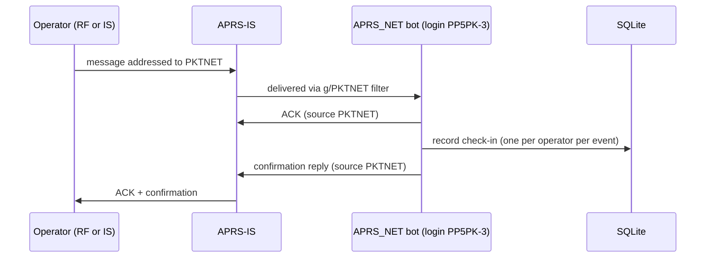

# APRS_NET


An **APRS net check-in bot** in the style of **#APRSThursday**, plus a matching
**PDF certificate generator**.

Operators send an APRS message to a special net callsign (e.g. `PKTNET`). The
bot acknowledges each message, logs the check-in to a local SQLite database, and
replies with a short confirmation. After the net, a companion tool turns the
logged check-ins into one participation certificate per operator, showing the
event name, date and check-in time.

The bot talks to **APRS-IS** over the internet, so it runs standalone on any
machine with Python and a network connection - it does **not** require Direwolf
or any RF hardware. It is typically run on a Raspberry Pi alongside an existing
igate (such as Direwolf), which is optional but recommended: an igate in your
area is what bridges the net's messages to and from the local RF network, so
stations on the radio (without internet) can take part too. The core bot uses
only the Python standard library; the optional certificate feature adds
`Pillow`, and optional email delivery uses a standard SMTP provider.

---

## Table of contents

- [Features](#features)
- [How it works](#how-it-works)
- [Components](#components)
- [Requirements](#requirements)
- [Installation](#installation)
- [Configuration](#configuration)
- [Usage](#usage)
  - [The daemon](#the-daemon)
  - [Managing events](#managing-events)
  - [Certificates](#certificates)
- [Database schema](#database-schema)
- [Operational notes](#operational-notes)
- [Roadmap](#roadmap)
- [Credits](#credits)
- [License](#license)

---

## Features

- Connects to **APRS-IS** with a verified login and a group-message filter, so
  it receives every message addressed to the net callsign — from RF or the
  Internet.
- Sends a proper **APRS ACK** for every message that carries a line number.
- Logs check-ins to **SQLite**, one per operator per event (`UNIQUE` constraint
  handles duplicates automatically).
- Replies with a configurable **confirmation** that includes the operator's
  callsign for station identification.
- **Event windows**: check-ins can be restricted to a scheduled time window, or
  the bot can run always-on with an auto-created daily event.
- **Reliable messaging**: outgoing replies carry a line number and are
  retransmitted until acknowledged, with automatic reconnection and keepalive.
- **Remote control over APRS**: public queries (`STATUS`, `LAST`, `TIME`, `ME`,
  `HELP`) and admin commands (`START`, `STOP`, `PAUSE`, `RESTART`, `USERS`) sent
  as APRS messages to the net callsign.
- **Group-chat room** (optional): a second callsign that relays each member's
  message to the others, with join/leave/who, flood guard and idle pruning.
- **Interactive certificates** (optional): after a check-in the bot offers a PDF
  certificate over APRS, resolving the operator's name from a local database
  with an on-air confirm/correct step, and can **email** the PDF via SMTP.
- **Certificate generator**: also a command-line tool for rendering an event's
  certificates in bulk onto the same template.
- Lightweight: the core bot needs only the Python standard library. The optional
  certificate feature adds `Pillow`; optional email uses an SMTP provider.

---

## How it works

- The bot logs in to APRS-IS **verified** with your callsign and passcode (for
  example `PP5PK-3`) and subscribes to the net callsign with the group filter
  `g/PKTNET`.
- Incoming messages addressed to the net callsign are delivered to the bot by
  that filter, regardless of whether they originated on RF or on the Internet.
- ACKs and replies are **injected with the net callsign as the source**
  (`PKTNET`), so the operator sees the whole exchange coming from the net. The
  verified login is what authorises that injection — the same mechanism an igate
  uses to inject packets on behalf of other stations.
- If you already run an igate that bridges RF and APRS-IS, a bot living purely on
  APRS-IS already reaches your local RF users: their messages are gated up to the
  Internet, the bot answers, and the ACK is gated back down to RF.


```mermaid
sequenceDiagram
    participant Op as Operator (RF or IS)
    participant IS as APRS-IS
    participant Bot as APRS_NET bot (login PP5PK-3)
    participant DB as SQLite
    Op->>IS: message addressed to PKTNET
    IS->>Bot: delivered via g/PKTNET filter
    Bot->>IS: ACK (source PKTNET)
    Bot->>DB: record check-in (one per operator per event)
    Bot->>IS: confirmation reply (source PKTNET)
    IS->>Op: ACK + confirmation
```

> **Station identification.** Because replies are sourced as the net callsign,
> the default confirmation text includes your real callsign (`PP5PK`) so the
> station remains identified. Keep your callsign in the reply templates.

---

## Components

| File | Purpose |
|------|---------|
| `pktnet_bot.py` | APRS-IS daemon: check-ins, ACKs, logging, replies, remote commands, room and the interactive certificate/email flow. Also provides the event/check-in management subcommands. |
| `pktnet_cert.py` | Command-line certificate generator: reads the database and renders one PDF per operator. |
| `fonts/` | TrueType fonts used to draw the certificate (Orbitron, Playfair Display Italic, Montserrat). |
| `certs/` | Certificate source data and tools: `users_base.csv` (name database source), `user_manager.sh` (interactive CSV editor), `create_user_db.php` + `update_db.sh` (build/refresh `users.db`), `pktnet_template.png` (the certificate background design) and a sample certificate. |
| `pktnet.conf.example` | Configuration template (copy to `/etc/pktnet/pktnet.conf`). |
| `pktnet.service` | Reference systemd unit (the installer generates its own with the right paths). |
| `install.sh` | Centralised installer (code in `/opt/APRS_NET`, config/data in place, builds `users.db`). |
| `uninstall.sh` | Removes the service and code (keeps config/data unless `--purge`). |
| `.gitignore` | Keeps `pktnet.conf` (your passcode/SMTP key) and Python cruft out of git. |
| `LICENSE` | MIT licence. |

---

## Requirements

- **Python 3.9+** (the core bot is standard-library only; the certificate
  feature needs `Pillow`, installed automatically by `install.sh`).
- An **amateur radio licence**, a callsign, and an **APRS-IS passcode**
  (the passcode is derived from your base callsign, so it is the same with or
  without an SSID). You can generate one with any APRS-IS passcode tool, e.g.
  <https://aprs.dvbr.net>.
- **`Pillow`** for the certificate generator only (it composites the
  operator's data onto the template image). On Raspberry Pi OS / Debian install
  it from apt to avoid the pip *externally-managed-environment* restriction:

  ```bash
  sudo apt install python3-pil
  ```

---

## Installation

### Quick install (recommended)

`install.sh` places everything in its proper place: code in `/opt/APRS_NET`,
configuration in `/etc/pktnet`, data in `/var/lib/pktnet`, a systemd unit
generated with the correct paths, and `pktnet_bot` / `pktnet_cert` CLI wrappers
in `/usr/local/bin`. It also installs the dependencies (`python3-pil`,
`php-cli`, `php-sqlite3`, `sqlite3`, `pv`) and builds the operator-name database
`users.db` from `certs/users_base.csv`. It is safe to re-run to upgrade — config
and data are preserved.

```bash
sudo git clone https://github.com/PP5PK/APRS_NET.git /opt/APRS_NET
cd /opt/APRS_NET
sudo bash install.sh --dry-run     # optional: preview every action
sudo bash install.sh               # do the install

sudo nano /etc/pktnet/pktnet.conf   # set your passcode (first install only)
sudo systemctl start pktnet.service
sudo journalctl -u pktnet -f
```

Run it with `sudo bash install.sh` (not `./install.sh`) so it works even though
files uploaded through the GitHub website arrive without the execute bit. The
service and CLI run the scripts via `python3`, so the `.py` files never need to
be executable — this removes the recurring permission problem entirely.

Because it is a git clone in `/opt/APRS_NET`, updating later is just:

```bash
cd /opt/APRS_NET && sudo git pull && sudo bash install.sh
```

Options: `--dir DIR` (install elsewhere), `--no-deps` (skip dependency install),
`--db-update` (pull the latest database from radioid.net via `update_db.sh`
instead of building from the committed CSV), `--no-start`, `-y` (no prompt),
`-n/--dry-run`.

> You do **not** need to `chmod +x` anything after cloning. If a `git pull` ever
> aborts with *"local changes would be overwritten"* and `git diff --summary`
> only shows `mode change`, that is just a file-permission difference — clear it
> once with `git config core.fileMode false`, then `git checkout -- . && git
> pull`.

### Manual install

If you prefer to do it by hand, the equivalent steps are:

```bash
sudo git clone https://github.com/PP5PK/APRS_NET.git /opt/APRS_NET
sudo useradd --system --no-create-home --shell /usr/sbin/nologin pktnet
sudo mkdir -p /etc/pktnet /var/lib/pktnet
sudo chown pktnet:pktnet /var/lib/pktnet

sudo cp /opt/APRS_NET/pktnet.conf.example /etc/pktnet/pktnet.conf
sudo chown root:pktnet /etc/pktnet/pktnet.conf
sudo chmod 0640 /etc/pktnet/pktnet.conf
sudo nano /etc/pktnet/pktnet.conf         # fill in your personal data

sudo apt install python3-pil php-cli php-sqlite3 sqlite3 pv   # deps
# Build the operator-name database from the CSV (needed for the cert flow):
sudo mkdir -p /var/lib/pktnet/certs
sudo cp /opt/APRS_NET/certs/{users_base.csv,create_user_db.php,update_db.sh,user_manager.sh,pktnet_template.png} /var/lib/pktnet/certs/
sudo chmod +x /var/lib/pktnet/certs/user_manager.sh
sudo php /var/lib/pktnet/certs/create_user_db.php
sudo chown -R pktnet:pktnet /var/lib/pktnet

# CLI wrappers that call python3 (so the .py never need the execute bit):
printf '#!/bin/sh\nexec /usr/bin/python3 /opt/APRS_NET/pktnet_bot.py "$@"\n'  | sudo tee /usr/local/bin/pktnet_bot  >/dev/null
printf '#!/bin/sh\nexec /usr/bin/python3 /opt/APRS_NET/pktnet_cert.py "$@"\n' | sudo tee /usr/local/bin/pktnet_cert >/dev/null
sudo chmod 0755 /usr/local/bin/pktnet_bot /usr/local/bin/pktnet_cert

# systemd unit pointing at the /opt/APRS_NET code
sudo tee /etc/systemd/system/pktnet.service >/dev/null <<'UNIT'
[Unit]
Description=PKTNET APRS Net check-in bot
Documentation=https://github.com/PP5PK/APRS_NET
After=network-online.target
Wants=network-online.target

[Service]
Type=simple
User=pktnet
Group=pktnet
ExecStart=/usr/bin/python3 /opt/APRS_NET/pktnet_bot.py run --config /etc/pktnet/pktnet.conf
Restart=on-failure
RestartSec=10

# Hardening
NoNewPrivileges=true
ProtectSystem=strict
ProtectHome=true
PrivateTmp=true
# ProtectSystem=strict makes everything read-only to the service except the
# paths below. If you set [cert] publish_dir, add that folder here too (the
# leading '-' makes systemd ignore it when absent) and let the pktnet user
# write to it.
ReadWritePaths=/var/lib/pktnet -/var/www/html/cloud/aprsnet_certs

[Install]
WantedBy=multi-user.target
UNIT

sudo systemctl daemon-reload
sudo systemctl enable --now pktnet.service
sudo journalctl -u pktnet -f
```

On a healthy start the log shows `Logged in as PP5PK-3, watching g/PKTNET`.
If it shows **unverified** instead, the passcode in the configuration is wrong.

### Uninstall

`uninstall.sh` removes the service and the installed code. Configuration and
data (including the check-in database) are kept unless you pass `--purge`.

```bash
chmod +x uninstall.sh
sudo ./uninstall.sh --dry-run    # preview, changes nothing
sudo ./uninstall.sh              # remove service + code, keep config/data
sudo ./uninstall.sh --purge      # also remove /etc/pktnet, /var/lib/pktnet, user
```

Use `--dir DIR` if the code was installed somewhere other than `/opt/APRS_NET`.

---

## Configuration

`pktnet.conf` is a simple INI file. Keep it out of your git repository — it
contains your passcode.

| Section | Key | Default | Description |
|---------|-----|---------|-------------|
| `aprsis` | `server` | `firenet.us` | APRS-IS server to connect to. |
| `aprsis` | `port` | `14580` | Filtered APRS-IS port. |
| `aprsis` | `login_call` | — | Verified login identity for the connection (e.g. `PP5PK-3`). Use an SSID that is **not** used by your igate or personal station. |
| `aprsis` | `passcode` | — | Your APRS-IS passcode. |
| `aprsis` | `net_call` | — | The special net callsign operators address (e.g. `PKTNET`). Max 9 characters; must not collide with a real callsign or existing service. |
| `net` | `require_active_event` | `true` | When `true`, check-ins only count inside a registered event window. When `false`, the bot auto-creates a daily event and always logs. |
| `net` | `checkin_keyword` | `CHECK` | First word a message must start with to count as a check-in. |
| `net` | `checkin_hint` | `Send CHECK to join the net. 73 de PP5PK` | Reply to a non-check message from someone who has **not** checked in yet. Empty = stay silent. |
| `net` | `checked_text` | `Check-in completed on {time}. Send HELP for commands` | Reply to a non-check message from someone who has **already** checked into the active net (`{time}` = their check-in, `YYYY/MM/DD-HHMMz`). |
| `net` | `confirm_text` | `Check-in OK {time}z. 73 de PP5PK` | Reply for a new check-in. |
| `net` | `dup_text` | `Already registered {time}z. 73 de PP5PK` | Reply when the operator already checked in. |
| `net` | `closed_text` | `PKTNET not active. 73 de PP5PK` | Reply when no event is active (only in `require_active_event = true` mode). |
| `net` | `admin_calls` | *(empty)* | Callsigns allowed to send admin remote-control commands (matched by base call, SSID ignored). Empty disables admin commands. |
| `net` | `ignore_calls` | `QRX ANSRVR WLNK-1` | Callsigns to never respond to (automated APRS services), to avoid message loops. |
| `net` | `rate_limit_per_min` | `10` | Mute a sender that exceeds this many messages/minute (loop/flood protection). `0` disables. |
| `net` | `rate_cooldown_min` | `10` | How long a rate-limited sender stays muted, in minutes. |
| `net` | `paused_text` | `PKTNET under maintenance...` | Reply sent to check-ins while the net is paused. |
| `room` | `room_call` | *(empty)* | Group-chat room callsign (e.g. `PKTQSO`). Empty disables the room. |
| `room` | `timeout_min` | `1440` | Drop room members idle for this many minutes. |
| `room` | `max_members` | `60` | Maximum members in the room. |
| `room` | `min_interval` | `10` | Minimum seconds between a member's relayed messages. |
| `cert` | `enable` | `false` | Turn the interactive certificate flow on or off. |
| `cert` | `dir` | `/var/lib/pktnet/certs` | Folder for generated PDFs, `users.db` and the CSV. |
| `cert` | `users_db` | `.../certs/users.db` | Read-only name database `users(callsign, name, city_state)`. |
| `cert` | `template` | `.../certs/pktnet_template.png` | Certificate background design the data is drawn onto. |
| `cert` | `flow_timeout_min` | `15` | Drop an unfinished certificate conversation after N minutes. |
| `cert` | `resend_min` | `5` | If the operator goes quiet mid-flow, resend the last prompt after N minutes (a lost message shouldn't cost the certificate). |
| `cert` | `publish_dir` | *(empty)* | If set, symlink each generated certificate into this folder so a website on the same server can list it. Empty = disabled. Requires the folder to be in the service's `ReadWritePaths` and writable by the `pktnet` user. |
| `email` | `enable` | `false` | Email the generated PDF over SMTP (needs the keys below). |
| `email` | `host` / `port` | `smtp-relay.brevo.com` / `587` | SMTP server and STARTTLS port. |
| `email` | `user` / `password` | — | SMTP login and the provider's SMTP key (keep out of git). |
| `email` | `from` / `from_name` | — | Sender address (on an SPF/DKIM-authenticated domain) and display name. |
| `email` | `reply_to` | *(empty)* | Optional Reply-To (any address). Empty replies to `from`. |
| `email` | `subject` | `Your PKTNET participation certificate` | Email subject line. |
| `messaging` | `max_retries` | `3` | Times to retransmit an unacknowledged reply. |
| `messaging` | `retry_interval` | `30` | Seconds between retransmissions. |
| `messaging` | `reply_delay` | `1.5` | Seconds to hold a reply after ACKing the incoming message, so the operator's device processes the ACK before the reply arrives (they collide otherwise on a half-duplex RF path). Also spaces consecutive replies. `0` disables. |
| `messaging` | `keepalive_interval` | `20` | Seconds between keepalive comments. |
| `messaging` | `rx_timeout` | `90` | Reconnect if no data is received within this many seconds. |
| `db` | `path` | `/var/lib/pktnet/pktnet.db` | SQLite database path. |

Reply templates accept these placeholders: `{time}` (HHMM UTC), `{call}`
(operator callsign) and `{event}` (event name). Keep each reply under **67
characters** — the APRS message limit.

---

## Usage

Global options `-c/--config` and `-v/--verbose` work either before or after the
subcommand.

### The daemon

```bash
# Run in the foreground (systemd normally does this for you):
pktnet_bot.py run -c /etc/pktnet/pktnet.conf
```

### Managing events

```bash
# Register a net window (times in UTC):
pktnet_bot.py -c /etc/pktnet/pktnet.conf addevent "PKTNET Net #1" \
    2026-06-25T00:00:00Z 2026-06-25T23:59:59Z

# List events and their check-in counts:
pktnet_bot.py -c /etc/pktnet/pktnet.conf events

# End a net early (defaults to the active event):
pktnet_bot.py -c /etc/pktnet/pktnet.conf endevent

# Delete a net and its check-ins:
pktnet_bot.py -c /etc/pktnet/pktnet.conf delevent 1

# List check-ins for an event (defaults to the most recent):
pktnet_bot.py -c /etc/pktnet/pktnet.conf checkins 1
```

Events live in the database and are read on every check-in, so you can register
or change a window **while the daemon is running** — no restart needed.

### Remote control (APRS commands)

Send an APRS message to the net callsign to query or control the net. Commands
are case-insensitive and optional `[brackets]` are allowed (e.g. `[STATUS]`).
A message that is neither a command nor the check-in keyword gets a short hint
(`checkin_hint`) if the operator hasn't checked in yet, or a confirmation with
their check-in time (`checked_text`) if they already have. When a reply is too
long for one APRS message it is split into several, each prefixed `[i/n]: ` so
the operator can see the order and notice if a part went missing.

**Public** — anyone can send these:

| Command | Reply |
|---------|-------|
| `STATUS` | Active net name and number of check-ins. |
| `LAST` | The last 5 callsigns to check in. |
| `TIME` | Time remaining in the active net (or that none is running). |
| `ME` | How many nets your base callsign has joined (all SSIDs counted together), plus your per-SSID check-in times in the active net. |
| `RESEND` | Re-generate and re-send your certificate for your latest net to the email on file (only when `[cert]` is enabled). |
| `RESET` | Restart the certificate data collection from the start (asks your email again) - useful if a message was lost and the flow got stuck (only when `[cert]` is enabled). |
| `HELP` | Lists the commands available to you (admins see the admin ones too). |

**Admin** — only callsigns in `admin_calls` (matched by base call):

| Command | Action |
|---------|--------|
| `USERS` | List every callsign in the active net (split across messages if long). |
| `START [name]` | Start a net for today (until 23:59:59 UTC), regardless of `require_active_event`. An optional name follows the command (`START Rede da Serra`); without one it is named by date. |
| `STOP` | End the active net now. |
| `PAUSE` | Pause the net; check-ins get the `paused_text` maintenance reply and are not logged. |
| `RESTART` | Resume a paused net. |

An admin command sent by a non-admin is ignored (treated as a check-in), so the
admin commands stay invisible to ordinary participants. In `require_active_event
= false` mode, `STOP` returns the bot to its always-on behaviour (new
check-ins log into the undated daily net).

### Group chat room

If `room_call` is set (e.g. `PKTQSO`), the bot also runs a group-chat room on
that callsign. Members send messages to the room callsign and everything a
member sends is relayed to all the other members as `SENDER: text`.

| Command (to the room callsign) | Action |
|--------------------------------|--------|
| `JOIN` | Enter the room. |
| `LEAVE` (or `QRT`) | Leave the room. |
| `WHO` | List the members currently in the room. |
| `HELP` | Show the room commands. |

The message a member sends **to the room** is acknowledged (so their radio stops
retransmitting), but the relayed copies delivered to each member are sent
**without** an ACK, to keep RF traffic down. Members idle longer than
`timeout_min` are dropped automatically; `max_members` caps the room size and
`min_interval` throttles how often one member's messages are relayed. `JOIN`,
`LEAVE`, `WHO` and `HELP` are reserved words and are not relayed as chat.

> **Scale note.** Each room message becomes one packet per member (fan-out), so
> the room is best kept to tens of members and, ideally, APRS-IS side rather than
> gated to RF. For very large groups the shared ANSRVR service is the usual
> alternative.

### Certificates

There are two ways to make certificates: an **interactive flow over APRS** (the
bot asks each operator), and the **command-line generator** (you render them in
bulk).

#### Interactive flow (over APRS)

When `[cert] enable = true`, the first time an operator checks in to a net the
bot offers a certificate and walks them through it entirely by APRS message:

1. "Want a certificate? Reply your email (only to send it) or NO".
2. The operator replies an email. The bot looks their name up in `users.db`
   (a read-only `users(callsign, name, city_state)` table) and asks
   "Name: <name>. Reply YES to use it, or send the name" — so wrong or
   incomplete names in the database can be corrected on the spot. If no name is
   found it just asks for one.
3. The bot renders the PDF into `[cert] dir`.

Names are always normalised to Title Case with connective particles in lower
case (`MARIA DA SILVA` → `Maria da Silva`), even when typed by the operator,
and the callsign is shown in upper case without its SSID. The email and chosen
name are remembered per operator, so on later nets the bot just asks
"Use previous info? YES / NO" and shows the stored values, saving typing on the
radio (reply `NO` to enter a different email/name, or `YES` to reuse them).

APRS messages sometimes go missing. To keep a lost message from stranding the
flow, the bot **resends the last prompt** after `resend_min` minutes of silence,
and the operator can send `RESET` at any time to start the collection over. An
unanswered conversation is still dropped after `flow_timeout_min` minutes. The
bot can also email the PDF — see
[Emailing certificates](#emailing-certificates) below.

Put `users.db` and the `pktnet_template.png` template in the
`[cert] dir` folder — by default `/var/lib/pktnet/certs/`. The name database is
built from `certs/users_base.csv`; to add or correct operators, edit the CSV
with `certs/user_manager.sh` (an interactive editor) and rebuild `users.db` from
its *Create / Update SQL database* option — or run `create_user_db.php`
directly. `certs/update_db.sh` refreshes the base from radioid.net.

#### Emailing certificates

With `[email] enable = true` the bot emails each PDF as an attachment right
after it is generated, over SMTP. It is designed for a transactional provider
such as **Brevo**: put the SMTP host, port, login and **SMTP key** in the
`[email]` section, and set `from` to an address on a domain you have
authenticated (SPF + DKIM) at the provider — otherwise the mail lands in spam.
The send runs in the background so it never stalls the APRS loop, and the body
carries a short notice that the address is used only to deliver the certificate.
Because the config holds the SMTP key, keep `pktnet.conf` out of git (it already
is, via `.gitignore`).

##### Setting up Brevo (domain authentication and credentials)

Email needs a sending account and an **authenticated domain** so the messages
pass SPF/DKIM and are not treated as spam. Using [Brevo](https://www.brevo.com)
(free tier) as the example — other SMTP providers follow the same shape:

1. **Add and authenticate your domain.** In the Brevo panel, under *Senders,
   Domains & Dedicated IPs → Domains*, add your domain (e.g. `pp5pk.net`). Brevo
   shows the DNS records to prove ownership and sign your mail — typically a
   **DKIM** record and a Brevo verification/**DMARC** record, plus **SPF**
   guidance.
2. **Add those records at your DNS host** (your registrar's DNS panel — for this
   project, Dynadot). Copy each record exactly as Brevo shows it. One trap: if
   you already have an **SPF** record (a `TXT` starting with `v=spf1`), do **not**
   add a second one — edit the existing record to include Brevo's include (the
   value Brevo displays, e.g. `include:spf.brevo.com`). Two SPF records break
   authentication.
3. **Verify.** Back in Brevo, trigger verification. DNS propagation can take
   minutes to a few hours; once the domain shows as authenticated (DKIM/SPF
   green), you are ready.
4. **Get the SMTP credentials.** Under *SMTP & API → SMTP*, note the server
   (`smtp-relay.brevo.com`), port (`587`), your SMTP **login**, and generate an
   **SMTP key** (this is a dedicated key, not your account password). Put these
   in the `[email]` section as `host`, `port`, `user` and `password`.
5. **Authorize the sending IP.** Brevo blocks sends from unknown IPs with
   `525 5.7.1 Unauthorized IP address`. Under *Security → Authorized IPs*, add
   the **public IP** of the machine running the bot. Find it on the Pi with:

   ```bash
   curl -s https://api.ipify.org; echo
   ```

   (If your public IP is dynamic, re-authorize it when it changes, or disable the
   IP check if your account allows it.)
6. **Set the sender.** `from` must be an address on the authenticated domain
   (any mailbox on it works, e.g. `certs@pp5pk.net`). `reply_to` may be **any**
   address you actually read — even a Gmail — because it does not affect
   SPF/DKIM. Keep the real login and key only in `/etc/pktnet/pktnet.conf`, never
   in the committed example.

#### Command-line generator

```bash
# All participants of an event:
pktnet_cert.py -c /etc/pktnet/pktnet.conf --event 1 --out ./certs

# With operator names from a CSV ("callsign,name" per line):
pktnet_cert.py -c /etc/pktnet/pktnet.conf --event 1 --names ops.csv --out ./certs

# A single operator:
pktnet_cert.py -c /etc/pktnet/pktnet.conf --callsign PP5ABC-7
```

| Option | Description |
|--------|-------------|
| `-c, --config` | Config file, used to locate the database. |
| `--db` | Database path (overrides the config value). |
| `--event` | Event id. Defaults to the most recent event. |
| `--callsign` | Generate for a single operator only. |
| `--names` | Optional CSV `callsign,name` to print operator names. |
| `--out` | Output directory (default `./certs`). |
| `--template` | Certificate template image (default: from config, else `/var/lib/pktnet/certs/pktnet_template.png`). |

Certificates are built by drawing the callsign (base call only, no SSID), the
operator name, the event name, the date (DD/MM/YYYY) and the check-in time (UTC)
onto the template with Pillow. The fonts live in `fonts/` next to the code
(Orbitron for the callsign, an italic serif for the name, a clean sans for the
rest); text auto-shrinks to fit, so long callsigns and names stay inside their
areas.

---

## Database schema

```sql
CREATE TABLE events (
    event_id   INTEGER PRIMARY KEY AUTOINCREMENT,
    name       TEXT    NOT NULL,
    event_date TEXT    NOT NULL,          -- YYYY-MM-DD (UTC)
    start_utc  TEXT    NOT NULL,          -- ISO 8601 UTC
    end_utc    TEXT    NOT NULL,          -- ISO 8601 UTC
    net_call   TEXT    NOT NULL
);

CREATE TABLE checkins (
    id        INTEGER PRIMARY KEY AUTOINCREMENT,
    event_id  INTEGER NOT NULL REFERENCES events(event_id),
    callsign  TEXT    NOT NULL,
    ts_utc    TEXT    NOT NULL,           -- ISO 8601 UTC
    message   TEXT,
    UNIQUE(event_id, callsign)
);
```

The database is created automatically on first run (WAL mode, with a busy
timeout so the management subcommands can write while the daemon is running).

---

## Operational notes

- **`require_active_event` is read at startup.** Changing it in the config takes
  effect after `sudo systemctl restart pktnet`. Event windows, by contrast, can
  be added or changed live with `addevent`.
- **First run.** You do not need to define a window before starting the service.
  Start it, then register the window with `addevent` before operators begin to
  check in. In `require_active_event = true` mode, messages that arrive with no
  active window are answered with `closed_text` and are **not** logged.
- **SSID choice.** The `login_call` should use an SSID that is not already in use
  by your igate or personal station, to avoid an identity collision on APRS-IS.
- **Net callsign.** Pick something distinct (max 9 characters) that will not
  collide with a real callsign or an existing service such as `ANSRVR` or
  `WXSVR`.

---

## Roadmap

- `SIGHUP` reload so configuration changes apply without a restart.
- CSV export of an event's participant list.
- Optional merge of all certificates into a single PDF for batch printing.
- Direct KISS/AGWPE attachment to Direwolf for purely-local RF operation.

---

## Credits

Inspired by the **#APRSThursday** weekly net and by the **ioreth** APRS bot.
Built and maintained by **Daniel — PP5PK**.

---

## License

Released under the MIT License. See [`LICENSE`](LICENSE) for details.

---

73 de PP5PK · <https://pp5pk.net> · <https://github.com/PP5PK>
